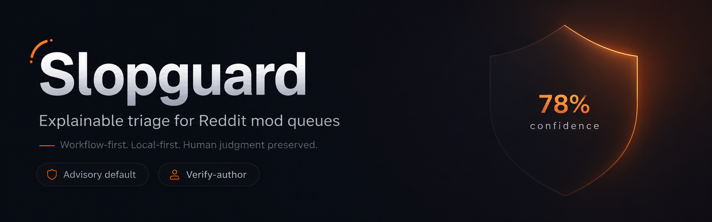

# Slopguard



> **An explainable triage layer for Reddit mods** — surfaces likely synthetic content, spam, scams, and coordinated inauthentic behavior with multi-signal scoring, confidence-based review tiers, verify-author appeals, and mod-collision prevention. **Human judgment is preserved by default.**

[](LICENSE)
[](https://developers.reddit.com/)
[](https://mod-tools-migration.devpost.com)

## The wedge

> Other tools ask: **"Is this AI?"**
> Slopguard asks: **"What should mods do with this suspicious item, and how do we handle it fairly?"**

That's the whole product.

## What it is

Slopguard is a Devvit-native moderation tool that scores incoming posts and comments using **six local-first signals** (no HTTP, no LLM required for the core product) and routes items into confidence tiers. Each flag comes with full per-signal explainability — never a black box.

It covers AI-generated content, karma-farm spam, affiliate/promo accounts, scam patterns, and dupe-content bots from the same multi-signal architecture. **Local signals run in milliseconds at zero cost.** An optional LLM-ensemble escalation tier (Gemini 2.5 Flash + Claude Haiku 4.5 + GPT-4o-mini) is available for mods who want a tiebreaker on uncertain cases.

## How it triages

| Confidence | Default action (Advisory mode) | Strict mode (opt-in) |
|---|---|---|
| 92%+ | Surface to mod queue with full explainability panel | Auto-remove (mod-configured) |
| 75–92% | **Verify-author**: auto-modmail asks author to explain; reply attaches to the review card | Same |
| 50–75% | Flag to mod queue with explainability | Same |
| < 50% | Ignore (not surfaced) | Same |

All thresholds + policy modes are per-sub configurable. **Default is Advisory** — Slopguard never removes anything by itself unless the mod team explicitly opts into Strict. Configure once; only see what needs attention.

## How it's different from [Stop AI](https://developers.reddit.com/apps/stop-ai)

Stop AI is the incumbent in this space (431 communities, detection-first via Binoculars/DetectGPT/GLTR/TypeTruth). Slopguard is **workflow-first**: confidence bands, review coordination, author verification, and reversible decisions. Works standalone or alongside Stop AI as the workflow + fairness + collision-safety layer.

|  | Stop AI | Slopguard |
|---|---|---|
| Approach | Detection-first (academic algorithms produce a score) | Workflow-first (multi-signal triage with explainable tiers) |
| Threshold | Fixed 50% binary | Graduated tiers, configurable per-sub |
| Default mode | Detection + optional autopilot enforcement | Advisory — surface to queue, mod decides |
| False-positive handling | Mod adjusts threshold | Verify-author modmail before action — fair to non-native English |
| Explainability | Score from algorithm | Per-signal panel ("em-dash density 3.2/1k chars, 1-day account, duplicate body hash, telegram contact") |
| Mod-collision prevention | None | Real-time "u/X is reviewing this" lock |
| Policy modes | One | Three (Advisory / Verify / Strict) |

## The six local signals

| Signal | What it catches | Cost |
|---|---|---|
| **Structural** | AI-output patterns — em-dash density, formulaic phrases, sentence-length burstiness, markdown heading patterns. Capped at 0.2 unless ≥2 indicators agree (non-native-English protection). | Free, ~5ms |
| **Behavioral** | Account / submission metadata where exposed by Devvit — new accounts, low karma, cross-posting velocity, posting cadence. | Free, ~10ms |
| **Promo** | Affiliate links, URL shorteners, "DM me for…" patterns, crypto wallet addresses, common pump phrases. | Free, ~5ms |
| **Contact-leak** | Phone numbers (with strong-shape filter), Telegram handles (only with context), WhatsApp links, personal emails. | Free, ~5ms |
| **Duplication** | Hash match against prior submissions in the same sub within a 48h window — catches AI mass-posting AND copy-paste spam. | Free, ~10ms |
| **History** | User prior-flag count + confirmed-flag rate, with time decay. | Free, ~5ms |
| **LLM ensemble** (opt-in escalation) | Gemini 2.5 Flash + Claude Haiku 4.5 + GPT-4o-mini, weighted fusion, disagreement signal. Only triggers on gray-band local scores. | ~$0.0004/item, ~800ms |

The orchestrator weights signals and applies a corroboration boost (single strong signal alone is not enough — multiple firing signals are needed before the combined score is amplified above the weighted average). When LLM escalation runs, the local and LLM scores are fused with local-leaning weight; the ratchet up only fires when both sides agree above 0.5.

## What you get as a mod

- **Per-signal explainability** on every flag — never a black box
- **Verify-author workflow** — auto-modmail asks the user to explain; reply attaches to the review card. Research-backed via [AppealMod (arxiv 2301.07163)](https://arxiv.org/abs/2301.07163).
- **Mod-collision lock** — "u/X is reviewing this" prevents two mods acting on the same item. Solves the [CHI 2026 documented 74.5% collision pain](https://arxiv.org/abs/2509.07314) directly.
- **Per-sub policy modes** — Advisory (default) / Verify / Strict
- **Mod menu actions** — "Analyze this post" (manual triage), "Claim review" (collision lock), "Explain score" (full breakdown), "Remove as AI slop" (single-click remove + reason + reply + modnote)
- **Daily metrics post** — items scored, flagged, removed, time saved
- **Modnote integration** for cross-mod consistency
- **Mobile parity** via Devvit — works in Reddit's mobile app

## Honesty stance

No AI detector is perfectly accurate. [Stanford documented a 61.22% false-positive rate](https://www.cell.com/patterns/fulltext/S2666-3899(23)00130-7) on TOEFL essays. Fixed-threshold autopilot without an appeals path can silently penalize innocent users — especially non-native English speakers.

Slopguard is built around this reality:

- Default mode is **Advisory** — never removes by itself unless Strict mode is explicitly enabled
- LLM ensemble is **opt-in escalation**, not core
- **Structural signal is capped at 0.2** unless ≥2 strong indicators agree, protecting non-native writers
- **Multi-model disagreement** is surfaced explicitly when LLM is enabled
- **Verify-author** safety net handles the 75–92% band fairly
- **Every action is reversible** and logged
- **Mod judgment is the final authority** on any ambiguous case

## Install

1. Visit [developers.reddit.com/apps/slopguard](https://developers.reddit.com/apps/slopguard)
2. Click Install → pick your subreddit
3. Open the app's Settings:
   - Set **Policy mode** (Advisory recommended for first 7 days)
   - **Optional:** paste a Gemini API key (free tier: [Google AI Studio](https://aistudio.google.com/apikey)) and toggle "Escalate uncertain cases to LLM"
4. Done. **The default is local-only, free, and flag-only.**

Optional: add Anthropic + OpenAI keys for the full three-model escalation ensemble.

## Cost

- **Local-only mode** (default): $0/month at any volume — runs entirely on Devvit Redis + signals
- **With LLM escalation**:
  - Gemini Flash free tier (~1,500 free requests/day) covers most small/medium subs at $0/month
  - Paid escalation: ~$0.0004 per item scored
  - Cost discipline: karma threshold gating, approved-user skip, account-age skip, daily spend cap, mod skip

## Architecture

```
PostCreate / CommentSubmit
        │
        ▼
runTriage (local-first)
        │
        ├─ structural ─┐
        ├─ behavioral ─┤
        ├─ duplication ┤   weighted fusion
        ├─ history    ─┤   + corroboration boost
        ├─ promo      ─┤
        └─ contact   ──┘
        │
        ▼  combined score in gray band [0.4, 0.75]?
        │      │
        │      │ yes  ─►  scoreItem (LLM ensemble) ─►  fuse(local, llm)
        │      │
        ▼      ▼
   final score + topReasons → saveScore (Redis) → policy action
                                                   │
                                                   ├─ Advisory: flag only
                                                   ├─ Verify:   flag + modmail to author
                                                   └─ Strict:   flag + modmail + auto-remove (if ≥ threshold)
```

See [`ARCHITECTURE.md`](ARCHITECTURE.md) for full details and [`PRODUCT.md`](PRODUCT.md) for the canonical product description.

## Verified data points cited above

- **CHI 2026 mod collision study** — 74.5% of mods experience modqueue collisions (Bajpai & Chandrasekharan, n=110, [arxiv 2509.07314](https://arxiv.org/abs/2509.07314))
- **Stanford AI-detector false positives** — 61.22% on TOEFL essays (Liang et al, Patterns 2023, Stanford HAI)
- **AppealMod** — research-backed friction-on-appeal reduces mod load while preserving fairness ([arxiv 2301.07163](https://arxiv.org/abs/2301.07163))
- **r/programming temporary AI ban** — April 2026 (Tom's Hardware)

## Roadmap (V2+)

- LLM-aided reply parsing for the verify-author workflow (auto-classify legitimate vs. evasive responses)
- Image AI detection via Gemini vision
- OCR for text-in-images (hidden promo/contact info)
- Cross-sub federation — opt-in shared bad-actor lists across participating subs (privacy framework first)

## Built for

The [Reddit Mod Tools & Migrated Apps Hackathon (2026)](https://mod-tools-migration.devpost.com), closing 2026-05-27.

## Author

[Shifat Islam Santo](https://github.com/oneKn8), UTD CS '27 — [u/shifatsanto75](https://reddit.com/user/shifatsanto75)

## License

MIT — see [`LICENSE`](LICENSE).
